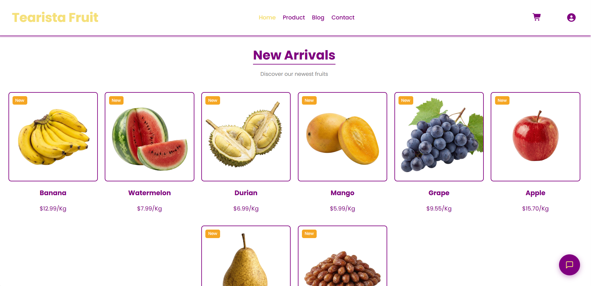
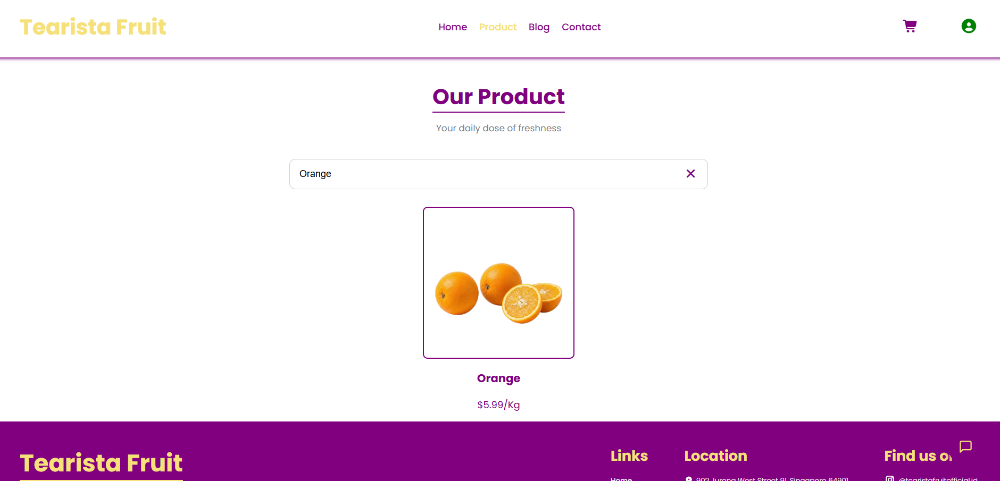
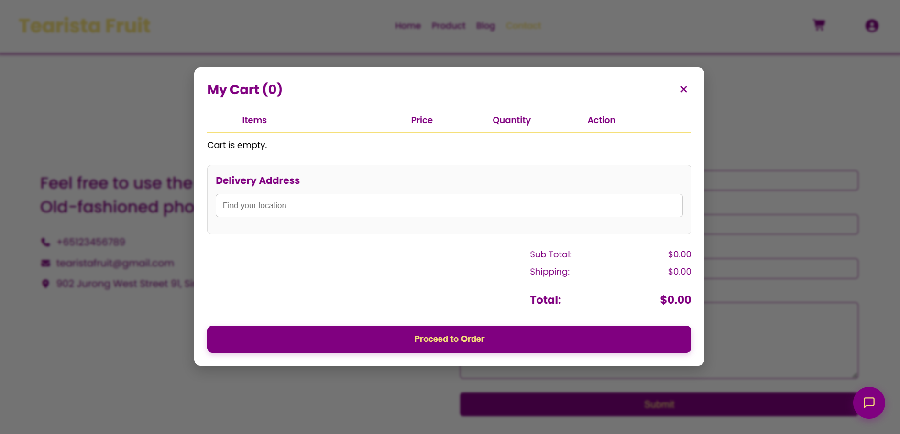
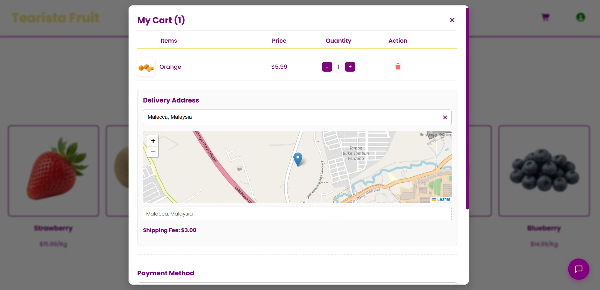
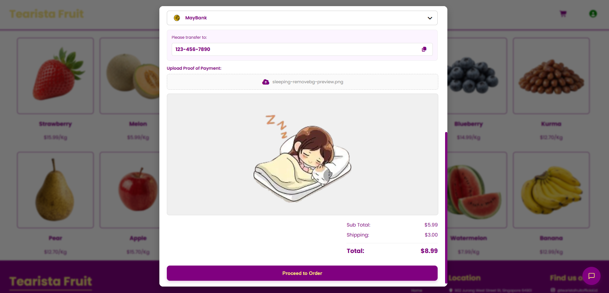
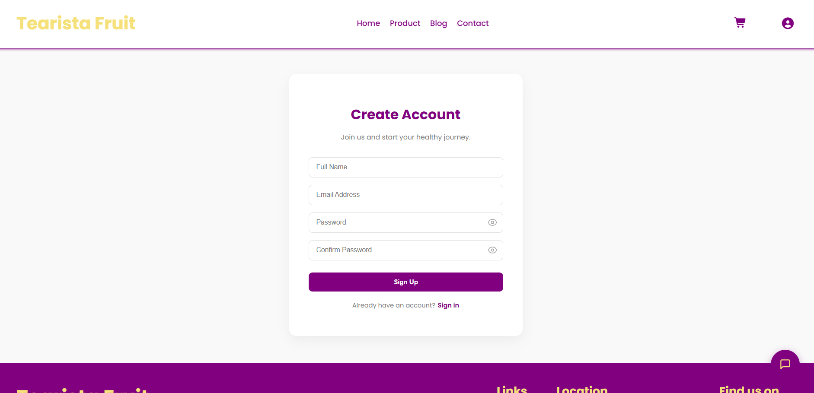
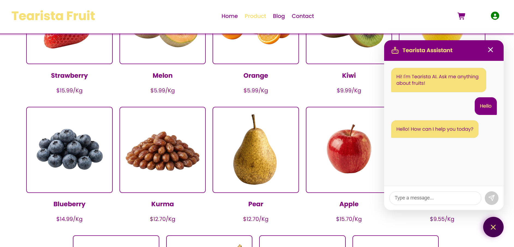
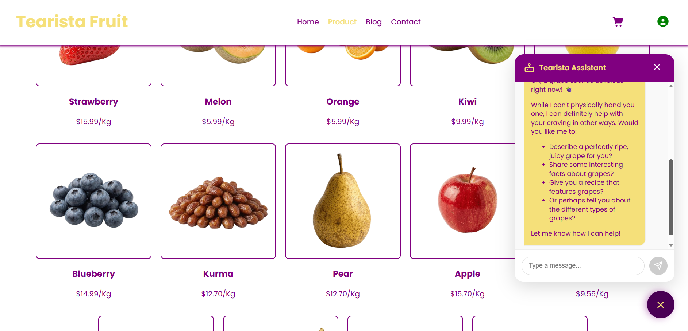

# Tearista Fruit
Tearista Fruit Shop is a modern, responsive e-commerce web application designed for selling premium fruits. It features a seamless shopping experience with real-time order tracking, interactive maps for delivery, and a dynamic blog section.

## 📸 Screenshots

### 🏠 Homepage
<p align="center">
  
  
  
</p>

---

### 🍎 Product Catalog
<p align="center">
  
  
</p>

<p align="center">
  
</p>

---

### 🛒 Cart & Checkout
<p align="center">
  
  
</p>

<p align="center">
  
  
</p>

---

### 🔐 Authentication
<p align="center">
  
  
</p>

<p align="center">
  
</p>

---

### 🤖 AI Chatbot Assistant
<p align="center">
  
  
</p>

---

## 🚀 Tech Stack

### Frontend
* **React.js**: Core framework for building the user interface.
* **CSS3**: Custom styling for a unique and responsive design.
* **React Router Dom**: For seamless page navigation (SPA).
* **React Hot Toast**: For beautiful toast notifications.
* **Leaflet & React-Leaflet**: Interactive maps for selecting shipping addresses.
* **Framer Motion**: For smooth UI animations.

### Backend
* **Node.js**: JavaScript runtime environment.
* **Express.js**: Web framework for handling API requests and server-side logic.
* **Cors**: Middleware to enable Cross-Origin Resource Sharing.

### Database & Storage
* **Supabase**: Used for:
    * **PostgreSQL Database**: Storing users, products, orders, cart items, and blogs.
    * **Authentication**: Secure user login and signup.
    * **Storage**: Hosting product images and blog assets.

---

## ✨ Key Features

### 🛒 Shopping Experience
* **Product Catalog**: Browse fresh fruits and "New Arrivals" with detailed descriptions.
* **Dynamic Cart**: Add/remove items, adjust quantities, and view real-time subtotal calculations.
* **Smart Checkout**:
    * **Map Integration**: Users can pin their exact location on a map to auto-fill the address.
    * **Shipping Fee**: Automatic calculation based on delivery logic.
    * **Payment Proof**: Upload screenshot functionality for bank transfer verification.

### 👤 User Management
* **Authentication**: Secure Sign Up and Login system.
* **User Profile**: View personal details and update username/profile information.
* **Order History & Tracking**:
    * View active orders.
    * **Live Countdown Timer**: A real-time timer showing delivery arrival (e.g., "Arriving in 18m 30s").
    * Auto-update status when the order is completed.

### 📰 Content
* **Blog Section**: Read detailed articles about fruit health benefits, farming tips, and recipes.

### 📱 UI/UX
* **Fully Responsive**: Optimized for Desktop, Tablet, and Mobile devices.
* **Interactive Modals**: Cart and Profile are presented as elegant pop-up modals.

---


## 🛠️ How to Run Locally

Follow these steps to clone and run the project on your local machine.

### Prerequisites
* Node.js installed.
* A Supabase account (for database connection).

### 1. Clone the Repository
```sh
git clone https://github.com/tearistaa/Tearista-Fruit.git
```

```sh
cd tearista-fruit
```

### 2. Backend Setup
```sh
cd backend
```

```sh
npm install
```

### 2.1 Setting .env File
Create a .env file in the backend folder and add your Supabase credentials

```sh
SUPABASE_URL=your_supabase_url
SUPABASE_ANON_KEY=your_supabase_anon_key
```

### 3. Frontend Setup
```sh
cd frontend
```

```sh
npm install
```

### 3.1 Setting .env File
Create a .env file in the frontend folder and add your Supabase credentials and Gemini API Key

```sh
REACT_APP_SUPABASE_URL=your_supabase_url
REACT_APP_SUPABASE_ANON_KEY=your_supabase_anon_key
REACT_APP_GEMINI_API_KEY=your_gemini_api_key
```

### 4. Start the React Application
in the backend folder 

```sh
nodemon server
```

in the frontend folder
```sh
npm start
```
